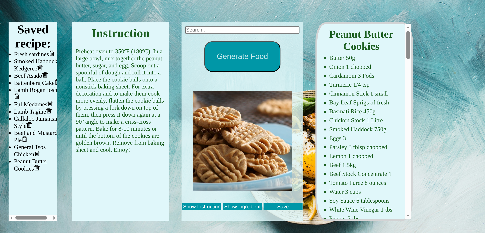

# RecipeGen 🍽️ 
RecipeGen is a dynamic recipe generator website that help users discover new meals if they unsure of what to make or they want to spice up their meal through a randomizer. Powered by MealDB API, user can view instructions on how to cook the food along with ingreidents for the meal. 

#Features 
- Generate a random recipe with image, ingredients, and video instruction
- Search Recipe by name
- Saved Meal to local storage 

#Tech Stack 
- HTML, CSS, Javascript
- TheMealDB API: https://www.themealdb.com/api.php 
- Local storage 
- Dom manipulation 

#Screenshot 

#installation 
git clone https://github.com/Ricketrice/RecipeGen
cd RecipeGen
# Open index.html in your browser

